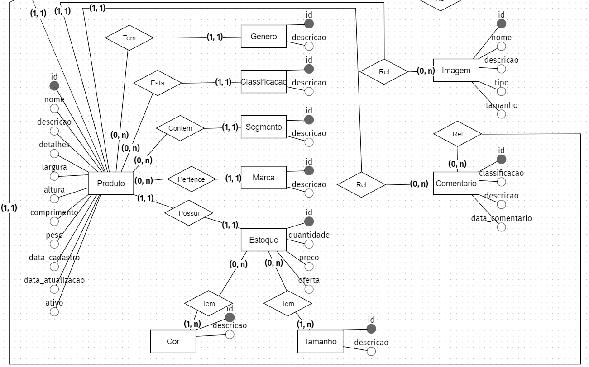

<h1 align="center">
  💻 Outono Fashion E-commerce
</h1>

✅ Design Responsivo (Angular)
✅ Gateway Pagamento (Teste)
✅ Segurança e Autenticação JWT (Autenticação)
✅ CMS (Dashboard Estatísticas e Gestão)
✅ RESTApi (Spring Boot)

## ✨ Objetivo:

- **Definição:** Construção E-commerce moda e vestuário

📒 Requisitos

- **Produto**
    - Descritivo: Nome, Descrição, Detalhes, Imagem, Estoque, Peso, Dimensões
    - Deve possuir: Gênero (masculino), Categoria (acessorios), Tipo (oculos), Tamanho (unico), Marca (coca-cola), Cor (azul), Preço (380,00)
    - Deve possui modal de preview
    - Filtrar no máximo 15 por página de busca

- **Cliente**
    - Autenticação para acessar a conta
    - Autenticação para comentário
    - Autenticação para favorito
    - Autenticação para pagamento
    - Cadastro restrito para um CPF/CNPJ e E-mail

- **Gestão Produto**
    - Tipo depende da Categoria
    - Marca depende do Tipo

- **Gênero**
    - Masculino, Feminino, Menino, Menina, Unissex

- **Categorias**
    - Calçados, Roupas, Acessórios

- **Tipos**
    - *Calçados:* Botas, Chinelos, Chuteiras, Crocs, Sapatênis, Tênis
    - *Roupas:* Bermudas, Calças, Camisas, Jaquetas, Moletons, Shorts
    - *Acessórios:* Bonés, Malas, Meias, Mochilas, Óculos, Relógios

- **Tamanho**
    - PP, P, M, G, GG, XG, 20 - 50 (múltiplo 2), Único

- **Marcas**
    - *Calçados:* Adidas, Asics, Fila, Kappa, Mizuno, Nike, Oakley, Olympikus, Puma
    - *Roupas:* Adidas, Aramis, Armadilho, Calvin Klein, Colcci, Everlast, Lacoste, Nike, Reserva
    - *Acessórios:* Adidas, Amora, Capricho, Caterpillar, Coca Cola, Colcci, Everlast

- **Cores**
    - Amarelo, Azul Claro, Azul Escuro, Bege, Bordô, Branco, Cinza, Dourado, Laranja, Lilás, Marinho, Marrom, Preto, Rosa, Roxo
	- Verde, Verde Escuro, Verde Claro, Vermelho, Vinho, Violeta

- **Faixa de preço**
    - Menos 60, Entre (60 - 100), Entre (100 - 160), Entre (160 - 240), Entre (240 - 380), Entre (380 - 770), Mais 770

✨ Rotas

- **Raíz**
    - Página Inicial: `outonofashion.com`

- **Página Produtos**
    - Página Produtos Masculino: `/masculino`
    - Página Produtos Feminino: `/feminino`
    - Página Produtos Menino: `/menino`
    - Página Produtos Menina: `/menina`

    - Página Produtos Promoções [Unissex]: `/promocoes`
    - Página Produtos Calçados [Unissex]: `/calcados`
    - Página Produtos Roupas [Unissex]: `/roupas`
    - Página Produtos Acessórios [Unissex]: `/acessorios`
    - Página Produtos Marcas [Unissex]: `/marcas`

- **Página Filtro**
    - Página Filtro Calçados: `/calcados/produtos?tipo-produto=chinelo?genero=masculino&tamanho=40&marca=coca-cola&cor=azul&preco=60-100`
    - Página Filtro Roupas: `/roupas/produtos?tipo-produto=biquini&genero=feminino&tamanho=m&marca=billabong&cor=verde&preco=100-160`
    - Página Filtro Acessórios: `/acessorios/produtos?tipo-produto=oculos&genero=menino&tamanho=50&marca=atitude&cor=prata&preco=240-380`
    - Página Filtro Marcas: `/marcas/produtos?marca=adidas?tipo-produto=agasalho&genero=menina&tamanho=p&cor=rosa&preco=380-770&sort=ofertas`

- **Página Autenticação**
    - Página Login/Cadastro: `/login`
    - Página Cadastro Confirmação: `/login/cadastrado`
    - Página Login Pagamento: `/login/finalizar-compra`

- **Página Dados Cliente**
    - Página Conta: `/conta`
    - Página Favorito: `/conta/favoritos`

- **Página Itens Compra**
    - Página Carrinho: `/carrinho`

- **Página Pagamento**
    - Página Finalizar Compra: `/finalizar-compra`
    - Página Confirmação: `/finalizar-compra/confirmacao`

- **Página Institucionais**
    - Página Sobre: `/sobre`
    - Página Política de Privacidade: `/politicas-privacidade`
    - Página Não Encontrada: `/pagina-nao-encontrada`
    - *Página Contato: `/contato`

- **Página Gerência**
    - Página CMS: `/cms`

- **Página Novidades**
    - Página Blog: `/blog`

🗂️ Página Inicial

- **Slideshow de Campanha [Hero]**
    - Imagem Background
    - Link Produtos
- **Seção de Ofertas [Campanha]**
    - Nome Campanha
    - Descrição Oferta
    - Imagem Background
    - Link Produtos
- **Produtos Gênero [Carrosel]**
    - Últimos Adicionados
    - Nome Produto
    - Preço
- **Banner [CTA]**
    - Nome Banner
    - Descrição Banner
    - Imagem Background
    - Link Produtos
- **Mais Vendidos [Carrosel]**
    - Mais Vendidos [Unissex]
    - Nome Produto
    - Preço
- **Top Marcas [Carrosel]**
    - Logo Marcas
- **Newsletter [Lead]**
    - Imagem Background
    - Oferta [Isca]
    - Regras Oferta
    - Form E-mail
    - Box Icons
        - Nome
        - Descrição

🎁 Página Produtos

- **Slideshow de Campanha [Hero]**
    - Imagem Background
    - Link Produtos
- **Produtos Miniatura [Categorização]**
    - Nome
    - Imagem
- **Container Ads [Campanha]**
    - Imagem
    - Link Produtos
- **Mais Baratos [Carrosel]**
    - Mais Vendidos [Unissex]
    - Nome Produto
    - Preço
- **Container Ads [Campanha]**
    - Imagem
    - Link Produtos
- **Novos [Carrosel]**
    - Mais Vendidos [Unissex]
    - Nome Produto
    - Preço
- **Banner [CTA]**
    - Nome Banner
    - Descrição Banner
    - Imagem Background
    - Link Produtos

🎯 Página Filtro

- **Banner [Hero]**
    - Imagem Background
    - Breadcrumb
- **Sidebar [Filtro]**
    - Gênero
    - Tipo de Produto
    - Tamanho
    - Marca
    - Cor
    - Preço
- **List [Card Produto]**
    - Ordenação
        Mais Populares
        Mais Vendidos
        Lançamentos
        Ofertas
        Maior Preço
        Menor Preço
        Melhor Avaliados
    - Card Container
- **Ofertas [Carrosel]**
- **Novidade [Carrosel]**

## 📌 Desenvolvimento (Steps):

📋 Conceito Entidades

- **Produto**

## 💼 Tecnologias utilizadas:

- Angular
  - HTML
  - SCSS
  - JavaScript
  - TypesScript

- Java
  - Spring Boot

- SQL
  - MySQL

<h2>🦄 Autor</h2>

<table>
  <tr>
    <td align="center">
      <a href="https://github.com/bhigoreduardo">
         
        
          <b>Higor Eduardo</b>
        
      </a>
    </td>
  </tr>
</table>