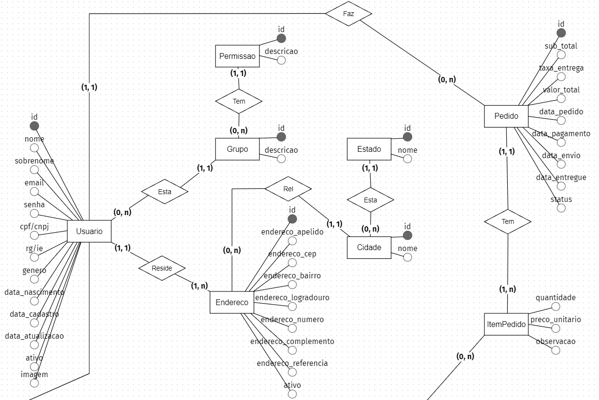

<h1 align="center">
  💻 Outono Fashion E-commerce
</h1>

- **PO (Product Owner):** Higor E. Batista
- **Scrum Master:** Higor E. Batista
- **Dev Team:** Higor E. Batista

✅ RESTApi
✅ Design Responsivo
✅ Segurança e Autenticação JWT
✅ Gateway Pagamento
✅ CMS (Dashboard Estatísticas e Gestão)

# ✨ Objetivo:

- **Necessidade:** Aplicação web (E-commerce) para facilitar compra de moda e vestuário
- **Público-Alvo:** Jovens estilosos conectados à rede

<b>📒 Regras de Negócio</b>

## Requisitos:
### 1. Usuários
- **Experiência do Usuário (Cliente):**
    - Autenticação para acessar a conta, comentar, favoritar, pagar/comprar (segurança)
    - Visualização prévia dos detalhes de produtos (modal)
    - Buscar e filtrar produtos limitando 12 produtos/página (avançada)
    - Cadastrar diferentes endereços de entrega (apelido)
    - Comentar em produtos comprados (credibilidade)
    - Permitir cadastrar somente um CPF/CNPJ e E-mail
    - Pagamento facilitado e flexível no cartão de crédito em até 12x sem juros
    - Pagamento cartão e boleto
    - Cupom de desconto restrito por CPF/CNPJ não cumulativo
    - Salvar cartões de crédito histórico
    - Devolução no cartão ou conta bancária do cliente

- **Experiência do Usuário (Administrador):**
    - Acessar todas compras, faturamento, chat
    - Cadastrar produto e usuário
    - Editar produto e usuário
    - Definir nível de acesso usuário
    - Liberação de cadastro de usuário (vendedor)
    - Cadastrar e Editar postagens Blog (todos)

- **Experiencia do Usuário (Vendedor):**
    - Conversar com cliente em chat
    - Buscar, acompanhar e editar status pedido
    - Editar próprias informações cadastrais
    - Cadastrar e Editar próprias postagens Blog

- **Características do Usuário [Cliente/ADM/Editor/Vendedor]:**
    - Nome
    - Sobrenome
    - E-mail (Único)
    - Senha
    - CPF/CNPJ (Único)
    - RG/IE (Único e opcional)
    - Gênero
    - Data de Nascimento
    - Apelido Endereço
        - Endereço: CEP, Bairro, Logradouro, Número, Complemento, Referência, Ativo (selecionado)
    - Ativo (Cadastro Ativo)
    - Imagem

### 2. Produtos
- **Características do Produto:**
    - Nome
    - Descrição (curta)
    - Detalhes (longa)
    - Imagem
    - Estoque
    - Peso
    - Dimensões: Comprimento, Largura, Altura
    - Gênero (masculino/feminino/menino/menina/unissex)
    - Categoria
    - Tipo
    - Tamanho
    - Marca
    - Cor
    - Preço
    - Oferta (Porcentagem)
    - Ativo

- **Características do Pedido:**
    - N produtos
    - Subtotal
    - Taxa da entrega
    - Valor total
    - Data do pedido
    - Data de pagamento
    - Data do envio
    - Data da entrega
    - Status: AGUARDANDO PAGAMENTO, PAGAMENTO CONFIRMADO, ENVIADO, ENTREGUE

- **Características do Gênero**
    - Descrição

- **Características da Categoria**
    - Descrição

- **Características do Tipo**
    - Descrição

- **Características do Tamanho**
    - Descrição

- **Características da Marca**
    - Descrição
    - Imagem

- **Características da Cor**
    - Descrição

    ### 2.1 Valores Produtos
    - **Valores do Gênero**
        - Masculino, Feminino, Menino, Menina, Unissex

    - **Valores da Categoria**
        - Calçados, Roupas, Acessórios
        Select * from TABELA where CAMPO like '%texto_para_encontrar%' collate utf8_general_ci

    - **Valores do Tipo**
        - *Calçados:* Botas, Chinelos, Chuteiras(M), Crocs, Sapatênis, Tênis
        - *Roupas:* Bermudas, Calças, Camisas, Jaquetas, Moletons, Shorts, Vestidos(F)
        - *Acessórios:* Bonés, Malas, Meias, Mochilas, Óculos, Relógios

    - **Valores do Tamanho**
        - PP, P, M, G, GG, XG, 20 - 50 (múltiplo 2), Único

    - **Valores da Marca**
        - *Calçados:* Adidas, Asics, Fila, Kappa, Mizuno, Nike, Oakley, Olympikus, Puma
        - *Roupas:* Adidas, Aramis, Armadilho, Calvin Klein, Colcci, Everlast, Lacoste, Nike, Reserva
        - *Acessórios:* Adidas, Amora, Capricho, Caterpillar, Coca Cola, Colcci, Everlast

    - **Características da Cor**
        - Amarelo, Azul Claro, Azul Escuro, Bege, Bordô, Branco, Cinza, Dourado, Laranja, Lilás, Marinho, Marrom, Preto, Rosa, Roxo
        - Verde, Verde Escuro, Verde Claro, Vermelho, Vinho, Violeta

### 3. Manipulação Produtos
- **Faixa de preço**
    - Menos 60, Entre (60 - 100), Entre (100 - 160), Entre (160 - 240), Entre (240 - 380), Entre (380 - 770), Mais 770

- **Gestão Produto**
    - Tipo depende da Categoria
    - Marca depende do Tipo

### 4. Blog
- **Características do Post (Blog)**
    - Título
    - Conteúdo (Text Rich)
    - Imagem Capa
    - Autor
    - Data Postagem
    - Categoria
    - Tags

<b>📃 Páginas (Front)</b>

### 1. Produtos
- **Página Produtos:** Dedicada ao Gênero ou Categoria de produtos
    - Página Produtos Unissex: `/produtos`
    - Página Produtos Masculino: `/masculino`
    - Página Produtos Feminino: `/feminino`
    - Página Produtos Menino: `/menino`
    - Página Produtos Menina: `/menina`

    - Página Produtos Promoções (Unissex): `/promocoes`
    - Página Produtos Calçados (Unissex): `/calcados`
    - Página Produtos Roupas (Unissex): `/roupas`
    - Página Produtos Acessórios (Unissex): `/acessorios`
    - Página Produtos Marcas (Unissex): `/marcas`

- **Página Filtro:** Dedicada ao resultado de busca do usuário (cliente)
    - Página Filtro Calçados: `/calcados/produtos?tipo-produto=chinelo?genero=masculino&tamanho=40&marca=coca-cola&cor=azul&preco=60-100`
    - Página Filtro Roupas: `/roupas/produtos?tipo-produto=biquini&genero=feminino&tamanho=m&marca=billabong&cor=verde&preco=100-160`
    - Página Filtro Acessórios: `/acessorios/produtos?tipo-produto=oculos&genero=menino&tamanho=50&marca=atitude&cor=prata&preco=240-380`
    - Página Filtro Marcas: `/marcas/produtos?marca=adidas?tipo-produto=agasalho&genero=menina&tamanho=p&cor=rosa&preco=380-770&sort=ofertas`

- **Página Produto Individual:** Dedicada a obter informações e escolha do produto
    - Camisa Poló Masculino: `/produtos?camisa-polo-masculina&id=1`

### 2. Usuários (Cliente)
- **Página Autenticação:** Dedicada a permissão de acesso ao usuário (cliente)
    - Página Login/Cadastro: `/login`
    - Página Cadastro Confirmação: `/login/cadastrado`
    - Página Login Pagamento: `/login/finalizar-compra`
    - Página Redefinir Senha: `/login/redefinir-senha`

- **Página Dados Cliente**
    - Página Conta: `/conta`
    - Página Favorito: `/conta/favoritos`

- **Página Itens Compra**
    - Página Carrinho: `/carrinho`

- **Página Pagamento**
    - Página Finalizar Login: `/finalizar-compra/login`
    - Página Finalizar Compra: `/finalizar-compra`
    - Página Confirmação: `/finalizar-compra/confirmacao`

### 3. Navegação Livre
- **Página Institucionais:** Dedicada a exploração do usuário (cliente)
    - Página Inicial: `outonofashion.com`
    - Página Sobre: `/sobre`
    - Página Política de Privacidade: `/politicas-privacidade`
    - Página Não Encontrada: `/pagina-nao-encontrada`
    - Página Contato: `/contato`
    - Página Blog: `/blog`

### 4. Autenticação Gestores
- **Página Gerência Usuário (Comum)**
    - Página Login/Cadastro CMS: `/cms-login`
    - Página Inicial CMS: `/cms`
    - Página Chat Clientes Online: `/cms/chat`
    - Página Perfil (Visualizar): `/cms/perfil`
        - Editar: `/cms/perfil?id=1`

- **Página Gerência Usuário (ADM)**
    - Página Usuários (Editores): `/cms/editores`
        - Visualizar: `/cms/editores?id=1`
        - Cadastrar: `/cms/editores/cadastrar`
        - Editar: `/cms/editores/editar?id=1`
    - Página Usuários (Vendedores): `cms/vendedores`
        - Visualizar: `/cms/vendedores?id=1`
        - Cadastrar: `/cms/vendedores/cadastrar`
        - Editar: `/cms/vendedores/editar?id=1`

- **Página Gerência Usuário (Editor/Vendedor)**
    - Página Cadastro Confirmação CMS: `/cms-login/cadastrado`

### 5. Gestão do Produto
- **Página Gerência Usuário (Comum)**
    - Página E-commerce Gênero (Listar): `/cms/produto-generos`
    - Página E-commerce Categoria (Listar): `/cms/produto-categorias`
    - Página E-commerce Tipo (Listar): `/cms/produto-tipos`
    - Página E-commerce Tamanho (Listar): `/cms/produto-tamanhos`
    - Página E-commerce Marca (Listar): `/cms/produto-marcas`
    - Página E-commerce Cor (Listar): `/cms/produto-cores`
    - Página E-commerce Produto (Listar): `/cms/produtos`
        - Visualizar: `/cms/produtos?id=1`
    - Página Pedidos (Listar): `cms/pedidos`
        - Visualizar: `/cms/pedidos?id=1`
        - Editar: `/cms/pedidos/editar?id=1`
    - Página Comentários Produto (Listar): `cms/comentarios`
        - Visualizar: `/cms/comentarios?id=1`

- **Página Gerência Usuário (ADM/Editor)**
    - Produto Gênero:
        - Cadastrar: `/cms/produto-generos/cadastrar`
        - Editar: `/cms/produto-generos/editar?id=1`
    - Produto Categoria:
        - Cadastrar: `/cms/produto-categorias/cadastrar`
        - Editar: `/cms/produto-categorias/editar?id=1`
    - Produto Tipo:
        - Cadastrar: `/cms/produto-tipos/cadastrar`
        - Editar: `/cms/produto-tipos/editar?id=1`
    - Produto Tamanho:
        - Cadastrar: `/cms/produto-tamanhos/cadastrar`
        - Editar: `/cms/produto-tamanhos/editar?id=1`
    - Produto Marca:
        - Cadastrar: `/cms/produto-marcas/cadastrar`
        - Editar: `/cms/produto-marcas/editar?id=1`
    - Produto Cor:
        - Cadastrar: `/cms/produto-cores/cadastrar`
        - Editar: `/cms/produto-cores/editar?id=1`
    - Produto:
        - Cadastrar: `/cms/produtos/cadastrar`
        - Editar: `/cms/produtos/editar?id=1`

### 6. Gestão do Blog
- **Página Gerência Usuário (Comum)**
    - Página Post Blog (Listar): `cms/posts`
        - Cadastrar: `/cms/posts/cadastrar`
        - Visualizar: `/cms/posts?id=1`
        - Editar: `/cms/posts/editar?id=1`

### 7. Gestão Páginas
- **Página Inicial**

# 📋 Briefing:

<b>🗂️ Página Inicial</b>

- **Banner Slideshow (Hero)**
    - Imagem Background
    - Link Produtos
- **Ofertas (Campanha)**
    - Nome Campanha
    - Descrição Oferta
    - Imagem Background
    - Link Produtos
- **Produtos Gênero Feminino (Carrosel)**
    - Últimos Adicionados (Lim. 12)
    - Nome Produto
    - Preço
- **Banner Promoções Main (CTA)**
    - Nome Banner
    - Descrição Banner
    - Imagem Background
    - Link Promoções
- **Mais Vendidos (Carrosel)**
    - Mais Vendidos (Unissex - Lim. 12)
    - Nome Produto
    - Preço
**Produtos Gênero Masculino (Carrosel)**
    - Últimos Adicionados (Lim. 12)
    - Nome Produto
    - Preço
- **Top Marcas (Carrosel)**
    - Logo Marcas
- **Newsletter (Lead)**
    - Imagem Background
    - Oferta (Isca)
    - Regras Oferta
    - Form E-mail
    - Box Icons
        - Nome
        - Descrição

<b>🎁 Página Produtos (Gênero/Categoria)</b>

- **Slideshow de Campanha (Hero)**
    - Imagem Background
    - Link Produtos
- **Produtos Miniatura (Categorização)**
    - Nome
    - Imagem
- **Container Ads (Campanha)**
    - Imagem
    - Link Produtos
- **Mais Baratos (Carrosel)**
    - Mais Vendidos
    - Nome Produto
    - Preço
- **Container Ads (Campanha)**
    - Imagem
    - Link Produtos
- **Novos (Carrosel)**
    - Mais Vendidos
    - Nome Produto
    - Preço
- **Banner (CTA)**
    - Nome Banner
    - Descrição Banner
    - Imagem Background
    - Link Produtos

<b>🎯 Página Filtro</b>

- **Banner (Hero)**
    - Imagem Background
    - Breadcrumb
- **Sidebar (Filtro)**
    - Gênero
    - Tipo de Produto
    - Tamanho
    - Marca
    - Cor
    - Preço
- **List (Card Grid)**
    - Ordenação
        Mais Populares
        Mais Vendidos
        Lançamentos
        Ofertas
        Maior Preço
        Menor Preço
        Melhor Avaliados
    - Card Container
    - Navigator
- **Ofertas (Carrosel)**
- **Novidade (Carrosel)**

<b>🧺 Produto Individual</b>

- **Breadcrumb**
- **Informação Produto**
    - Miniaturas
    - Imagem Destaque
    - Descrições
        - Marca
        - Nome
        - Valor Unitário (até 12x)
        - Cor
        - Tamanho
    - Botão Comprar
    - Medidas
    - Frete
    - Descrição
    - Detalhes
- **Comentários (Carrosel)**
    - Nome Cliente
    - Classificação
    - Descrição
    - Data
- **Produtos Semelhantes (Carrosel)**
- **Ofertas Gênero (Carrosel)**

<b>🔑 Página Autenticação (Cliente)</b>

- **Login**
    - Logo
    - Formulário

- **Cadastro**
    - Logo
    - Termos de privacidade
    - Formulário (PF/PJ)
    - Mensagem Sucesso

- **Redefinir Senha**
    - Logo
    - Formulário
    - Mensagem Sucesso

<b>🎛️ Conta (Cliente)</b>

- **Breadcrumb**
- **Informações Cliente**
    - Dados Pessoais
    - Meus pedidos
    - Endereços
    - Atendimento

- **Favoritos (Header)**
    - Card Container

<b>🛒 Carrinho (Cliente)</b>

- **Headline (Quantidade Itens)**
- **List Container**
    - Imagem Produto
    - Descrição (Marca/Nome)
    - Quantidade (Alterar)
    - Valor Unitário
    - Subtotal
    - Botão Remover
- **Campo de CEP (Cálculo de Frete)**
- **Resumo Compra**
    - Subtotal
    - Frete
    - Total (até 12x)
- **Produtos Relacionados (Carrosel**
    - Mais Vendidos (Gênero, Categoria e Tipo - Lim. 12)
    - Nome Produto
    - Preço

<b>💳 Pagamento (Cliente)</b>

- **Página Finalizar Login**
    - Header Steps
    - Formulário

- **Página Finalizar Compra**
    - Header Steps
    - Seleção Endereço
    - Forma Pagamento
    - Container Produtos Pedido
        - Imagem
        - Marca
        - Nome
        - Quantidade
        - Valor Unitário
        - Subtotal
        - Taxa de Entrega
        - Total (até 12x)
    - Cupom Desconto

- **Página Confirmação**
    - Resumo Pedido

## 📌 Roadmap (Steps):

<b>🧑‍⚖️ Hierarquia Dependências</b>

- **Sprint Básico Funcionamento Usuário**
    - 1. Página Inicial
    - 2. Página Filtro
    - 3. Página Produto Individual
    - 4. Página Autenticação (Cliente)
    - 5. Página Carrinho (Cliente)
    - 6. Página Pagamento (Cliente)
    - 7. Página Conta (Cliente)

- **Sprint Melhor Experiência Usuário**
    - 1. Página Produtos
    - 2. Favoritos
    - 3. Contato
    - 4. Não Encontrada

- **Experiência ADM**
    - 1. Login/Cadastro
    - 2. Página E-commerce (Produto) -> Cadastros (Produto)

- **Coleta Experiência Cliente**
    - 1. Comentário

- **Análise Produtos ADM**
    - 1. Pedidos
    - 2. Comentários

- **Expansão do Time Gestores**
    - 1. Cadastro Confirmação
    - 2. Página Inicial (Relatórios)
    - 3. Editar Pefil

- **Controle ADM**
    - 1. Cadastro Editor
    - 2. Cadastro Vendedor

- **Branding Negócio**
    - 1. Sobre
    - 2. Políticas de Privacidade

- **Acompanhamento Cliente-Vendedores**
    - 1. Chat

- **Geração de Conteúdo (SEO)**
    - 1. Blog

- **Gestão de campanhas**
    - 1. Inicial
    - 2. Produtos
    - 3. Newsletter

- **Gestão Institucionais**
    - 1. Sobre
    - 2. Políticas de Privacidade

<b>🚀 Scrum Funcionamento Usuário</b>

### Backlog Funcionamento Usuário

- [x] Design (Figma)
    - [x] Página Inicial
    - [x] Página Filtro
    - [x] Página Produto Individual
    - [x] Página Autenticação (Cliente)
    - [x] Página Carrinho (Cliente)
    - [x] Página Pagamento (Cliente)
    - [x] Página Conta (Cliente)
- [ ] Front-End (Angular)
    - [ ] Página Inicial (Header - Hero - Footer)
    - [ ] Página Filtro
    - [ ] Página Produto Individual
    - [ ] Página Autenticação (Cliente)
    - [ ] Página Carrinho (Cliente)
    - [ ] Página Pagamento (Cliente)
    - [ ] Página Conta (Cliente)
- [ ] Back-End (RESTApi Spring)
    - [ ] Página Filtro
    - [ ] Página Produto Individual
    - [ ] Página Autenticação (Cliente)
    - [ ] Página Carrinho (Cliente)
    - [ ] Página Pagamento (Cliente)
    - [ ] Página Conta (Cliente)

### Sprint Planning Funcionamento Usuário [1 2 3 5 8]
Task      | Score | Responsável
----------|-------|------------
Design    | 3     | Higor
Front-End | 5     | Higor
Back-End  | 3     | Higor

<b>⏳ Sprint Funcionamento Usuário</b>

- ### Prazos
    - Design (1 dia)
    - Back-End (3 dias)
    - Front-End (3 dias)

- ### Em Andamento
    - [x] 28/10 Design
    - [ ] 29/10 Back-End

- ### Validação
    - [ ] 29/10 Design

- ### Aguardando Deploy

- ### Em Produção

- ### Revisão Sprint

## 🗃️ Documentos Projeto:

<b>📝 Modelagem de Entidades</b>

<b>🧺 Produto</b>

<b>👦 Usuário</b>

## 💼 Tecnologias utilizadas:

- #### Angular (Front)
  - HTML
  - SCSS
  - JavaScript
  - TypesScript

- #### Java (Back)
  - Spring Boot

- #### SQL (Banco)
  - PostgreSQL

<h2>🦄 Autor</h2>

<table>
  <tr>
    <td align="center">
      <a href="https://github.com/bhigoreduardo">
         
        
          <b>Higor Eduardo</b>
        
      </a>
    </td>
  </tr>
</table>